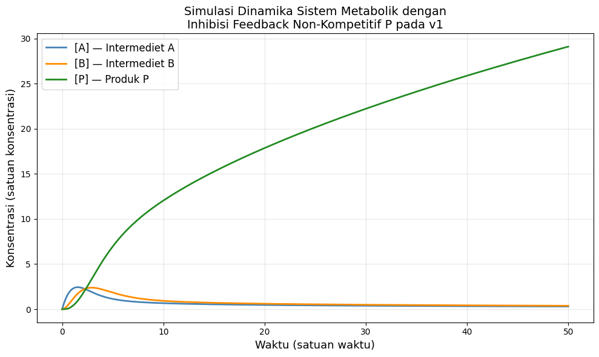

# Simulasi Dinamika Sistem Metabolik
### Zafiero Hasby Dzikri - 23/514655/BI/11199
### UAS Bioteknologi (BISB211605) — Fakultas Biologi, Universitas Gadjah Mada

---

## Deskripsi

Repositori ini berisi simulasi model kinetik jalur metabolik 4-reaksi dengan inhibisi feedback alosterik non-kompetitif. Model ini dibangun dalam konteks rekayasa metabolik untuk memproduksi biokimia bernilai tinggi menggunakan mikroorganisme inang yang teroptimasi.

---

## Topologi Jaringan Metabolik

```
X --[v1]--> A --[v2]--> B --[v3]--> P
                 |
                [v4]
                 |
                 v
            Byproduct

P -----(inhibisi alosterik non-kompetitif)-----> v1
```

| Reaksi | Deskripsi |
|--------|-----------|
| v1 | X → A (langkah komitmen awal, diinhibisi oleh P) |
| v2 | A → B (konversi intermediet) |
| v3 | B → P (produksi produk target) |
| v4 | A → Byproduct (escape pathway endogen) |

---

## Model Kinetik

### Persamaan Diferensial (ODE)

$$\frac{d[A]}{dt} = v_1 - v_2 - v_4$$

$$\frac{d[B]}{dt} = v_2 - v_3$$

$$\frac{d[P]}{dt} = v_3$$

### Kinetika v1 dengan Inhibisi Non-Kompetitif

$$v_1 = \frac{V_{1,max} \cdot [X]}{(K_{m1} + [X]) \cdot \left(1 + \frac{[P]}{K_i}\right)}$$

---

## Parameter Simulasi

| Parameter | Makna | Nilai |
|-----------|-------|-------|
| V₁,max | Laju maksimum v1 | 5.0 |
| Km1 | Konstanta Michaelis untuk v1 | 2.0 |
| Ki | Konstanta inhibisi | 3.0 |
| X | Konsentrasi substrat eksternal (konstan) | 10.0 |
| k2 | Konstanta laju orde pertama A → B | 1.0 |
| k3 | Konstanta laju orde pertama B → P | 0.8 |
| k4 | Konstanta laju orde pertama A → Byproduct | 0.3 |

---

## Script Simulasi

Lihat script lengkap: [`simulation.py`](simulation.py)

```python
import numpy as np
from scipy.integrate import solve_ivp
import matplotlib.pyplot as plt

# Parameter
V1max = 5.0
Km1   = 2.0
Ki    = 3.0
X     = 10.0
k2    = 1.0
k3    = 0.8
k4    = 0.3

def system(t, y):
    A, B, P = y
    v1 = (V1max * X) / ((Km1 + X) * (1 + P / Ki))
    v2 = k2 * A
    v3 = k3 * B
    v4 = k4 * A
    return [v1 - v2 - v4, v2 - v3, v3]

# Kondisi awal dan rentang waktu
y0     = [0.0, 0.0, 0.0]
t_span = (0, 50)
t_eval = np.linspace(0, 50, 1000)

# Integrasi ODE
sol = solve_ivp(system, t_span, y0, t_eval=t_eval, method='RK45')

# Plot
fig, ax = plt.subplots(figsize=(10, 6))
ax.plot(sol.t, sol.y[0], label='[A] — Intermediet A', color='steelblue',   linewidth=2)
ax.plot(sol.t, sol.y[1], label='[B] — Intermediet B', color='darkorange',  linewidth=2)
ax.plot(sol.t, sol.y[2], label='[P] — Produk P',      color='forestgreen', linewidth=2)
ax.set_xlabel('Waktu (satuan waktu)', fontsize=13)
ax.set_ylabel('Konsentrasi (satuan konsentrasi)', fontsize=13)
ax.set_title('Simulasi Dinamika Sistem Metabolik dengan\nInhibisi Feedback Non-Kompetitif P pada v1', fontsize=14)
ax.legend(fontsize=12)
ax.grid(True, alpha=0.3)
plt.tight_layout()
plt.savefig('Simulasi Model Kinetik.png', dpi=150)
plt.show()

# Nilai steady-state
print(f"Nilai pada t=50:")
print(f"  [A] = {sol.y[0,-1]:.4f}")
print(f"  [B] = {sol.y[1,-1]:.4f}")
print(f"  [P] = {sol.y[2,-1]:.4f}")
```

---

## Hasil Simulasi



### Nilai Steady-State (t = 50)

| Metabolit | Konsentrasi |
|-----------|-------------|
| [A] | 0.3019 |
| [B] | 0.3818 |
| [P] | 29.0968 |

---

## Interpretasi Biologis

Sistem mencapai **steady-state** pada sekitar t = 20–25 satuan waktu. Intermediet A dan B mencapai keseimbangan dinamis dengan konsentrasi plateau yang rendah, sementara produk P terus terakumulasi secara progresif.

Inhibisi non-kompetitif P terhadap v1 bekerja melalui peningkatan faktor inhibisi `(1 + [P]/Ki)` pada penyebut persamaan kinetik, sehingga laju v1 menurun seiring akumulasi P. Mekanisme ini merupakan representasi klasik dari *end-product inhibition* yang umum dijumpai pada jalur biosintesis asam amino dan nukleotida.

Untuk meningkatkan produktivitas P dalam konteks rekayasa metabolik, strategi yang dapat diterapkan meliputi:
- Rekayasa enzim v1 untuk menurunkan sensitivitas terhadap P (meningkatkan nilai Ki)
- *In situ product removal* (ISPR) untuk menjaga [P] intraselular tetap rendah
- Overekspresi v3 untuk mempercepat konversi B → P

---

## Cara Menjalankan

```bash
pip install numpy scipy matplotlib
python simulation.py
```

---

## Referensi

- Orth, J.D., Thiele, I., & Palsson, B.Ø. (2010). What is flux balance analysis? *Nature Biotechnology*, 28(3), 245–248.
- Bhatt, D.L. et al. (2014). Metabolic pathway regulation and feedback inhibition. *Metabolic Engineering*.

---

*Matakuliah Bioteknologi (BISB211605) — T.A. 2025/2026*  
*Fakultas Biologi, Universitas Gadjah Mada*
